# TELESCOPE 🔭 — manual

*Un analizador de audio que además concluye. Gratis y open source (AGPLv3), de
[OVNI Audio](https://ovniaudio.com). Versión 0.1.0. English: [`README.md`](README.md).*

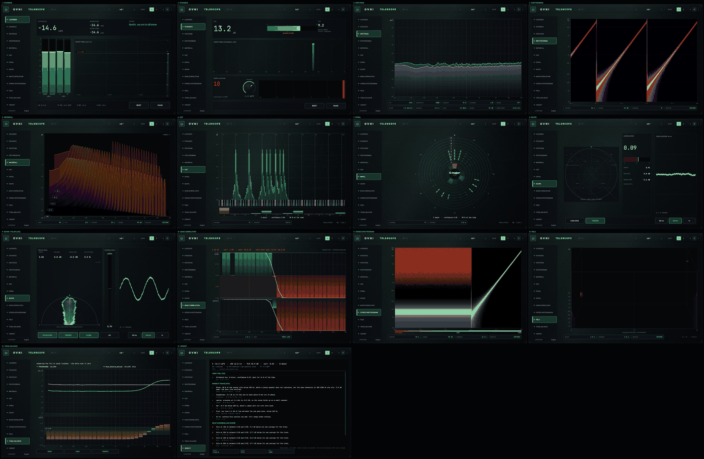

---

## Qué es este plugin

Trece **lentes** sobre un solo motor de análisis, más un motor de reglas que convierte lo medido en
frases — cada una con el número que la sostiene y el id de la regla que la produjo.

**No toca tu audio.** TELESCOPE lee L y R, los empuja a su propio hilo de análisis y no escribe nada de
vuelta: **latencia 0, cola 0, salida bit-exacta**. No es una afirmación, es un test:
`tests/PassThroughTest.cpp` (`[telescope][null]`) pasa ruido estéreo determinista por el plugin con bypass
encendido y apagado, con cada una de las trece lentes seleccionada, en bloques de 1, 7, 64 y 4096
muestras, y desde una fuente mono — `NULL_MISMATCHES=0` en los cinco casos. Un segundo test
(`[gain][telescope]`) manda una señal a escala completa y comprueba que salen las *mismas* muestras.

El análisis corre en su propio hilo. El audio nunca espera por una medición.

### Qué NO es

- **No localiza fuentes.** FIELD y NIVEL POLAR muestran dirección de paneo por energía. No hay HRTF, ni
  ITD, ni azimut — recuperar dónde *estaba* un sonido a partir de una mezcla estéreo terminada no tiene
  solución única.
- **Sólo estéreo.** Ni surround ni Ambisonics.
- **Ninguna métrica de inteligibilidad de voz o de diálogo.**
- **Sin IA, sin red, sin telemetría.** VERDICT es una tabla determinista de umbrales. La misma señal da el
  mismo informe, palabra por palabra, y no sale nada de tu máquina.
- **"Sin hallazgos" no es "está terminado".** Leé la sección de VERDICT: ésta importa.

---

## Instalación en macOS

El instalador es un `.pkg`: doble clic, y el Installer de macOS deja los plugins donde tu DAW los busca
(`/Library/Audio/Plug-Ins/VST3` y `/Library/Audio/Plug-Ins/Components`). Te pide la contraseña de admin él
mismo. Nada queda en cuarentena, así que no hay ningún `xattr` que correr después.

El paquete va **firmado con Developer ID y notarizado por Apple**, así que Gatekeeper lo abre con doble clic
y no pregunta nada más. Si alguna vez macOS te avisa algo sobre *este* `.pkg`, no lo saltees: significa que
el archivo no es el que publicamos — bajalo de nuevo del release y compará su SHA-256 con `SHA256SUMS.txt`.

Requiere **macOS 11.0 (Big Sur) o superior**. El binario es universal: Apple Silicon e Intel.
En Windows 10+ es un VST3 x64 en un ZIP sin firma, en el mismo release; cómo instalarlo está en el `LEEME PRIMERO.txt` de adentro.

---

## La ventana

- **La tira de la izquierda** lista las trece lentes. Hacé clic para abrir una. Sólo se calculan los
  módulos que la lente abierta necesita, así que las que no estás mirando no cuestan nada — salvo el
  loudness, que está *siempre* encendido, para que el integrado, el LRA, el histograma y el conteo de
  clips nunca tengan un agujero porque estabas mirando otra cosa.
- **S · M · L** arriba a la derecha cambian el tamaño. No son el mismo dibujo escalado: cada tamaño tiene
  sus propias métricas.
- **IDIOMA** (dice `LANGUAGE` mientras el plugin esté en inglés), al pie de la tira, cambia el idioma de
  todo el plugin. Ver [Idioma](#idioma).
- **Al pasar el cursor** por cualquier gráfico hay una lectura — siempre del *dato*, nunca del color del
  píxel. Donde no hay dato, no hay lectura: no se inventa un número para llenar la cajita.

---

# Las lentes

## 1 · LOUDNESS

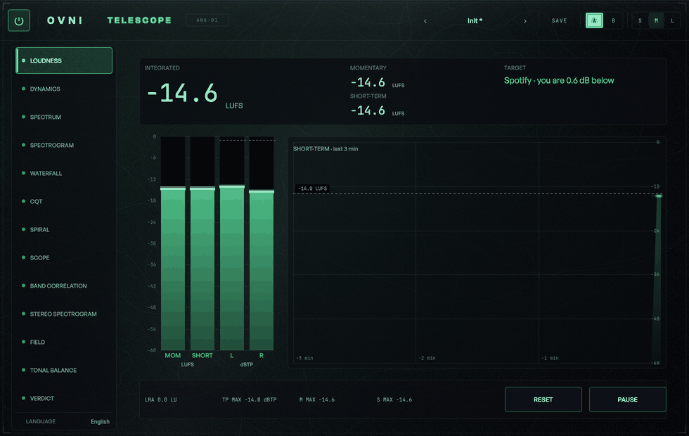

**Qué mide.** Cuán fuerte está el programa, según la norma de broadcast.

| Lectura | Definición |
|---|---|
| **INTEGRATED** (LUFS) | ITU-R BS.1770, doble compuerta: absoluta −70 LUFS, relativa 10 LU bajo la media de los que pasan |
| **MOMENTARY** (LUFS) | ventana de 400 ms |
| **SHORT-TERM** (LUFS) | ventana de 3 s, a 10 Hz |
| **LRA** (LU) | EBU Tech 3342: compuertas −70 y −20 LU, P95 − P10 de los short-term |
| **TP MAX** (dBTP) | true peak, BS.1770 Anexo 2, medido *antes* del K-weighting |
| **L / R** (dBTP) | el mismo true peak, **por canal** — mismo FIR, misma señal cruda, un máximo cada uno |
| **M MAX / S MAX** | máximos desde el último RESET |

**Cómo se lee.** Cuatro barras: **MOM** y **CORTO** en LUFS, **L** y **R** en dBTP, todas en la misma
escala 0 … −60. El número grande es el integrado. Las barras de pico llevan el umbral de clip de DYNAMICS
como línea ámbar punteada, su propio tick de pico y su máximo desde el RESET. La historia de abajo muestra
los últimos tres minutos de short-term con la momentary detrás. Si elegís una plataforma, su línea se
dibuja sobre las barras de LUFS y sobre la historia, y la distancia contra tu integrado sale escrita.

**Mientras una ventana se está llenando** —400 ms la momentary, 3 s la short-term— la barra muestra el
valor **parcial** con el relleno apagado y un contorno fino, y el número va en gris. Es la misma cuenta
sobre los hops que hay, no una estimación: cuando la ventana se llena coincide **al bit** con el número
oficial. El integrado no tiene parcial, y no lo va a tener: la compuerta es la compuerta.

**Controles.** `REINICIAR` (vacía todo y empieza de cero) · `PAUSA` / `SEGUIR` (el motor sigue drenando el
bus pero deja de integrar, así el contador de descartes no miente) · `OBJETIVO` (la plataforma).

**Qué no es.** El K-weighting se recalcula para tu sample rate desde el prototipo analógico — la norma sólo
publica la tabla a 48 kHz. Esa tabla es con lo que se comprueba el recálculo: evaluado a 48 kHz reproduce
los coeficientes publicados con un error máximo de 8.9 × 10⁻¹⁶. Y el true peak se sobremuestrea 4×, que
tiene una **sub-lectura máxima conocida** que el propio documento tabula: el test 3341 de la EBU nº 17 lee
−6.3160 dBTP contra un valor real de −6.0. Está dentro de la tolerancia del propio estándar
(+0.2 / −0.4 dBTP) y es una sub-lectura real: si tu máster mide −1.0 dBTP acá, tratalo como si estuviera
un poco más arriba.

---

## 2 · DYNAMICS

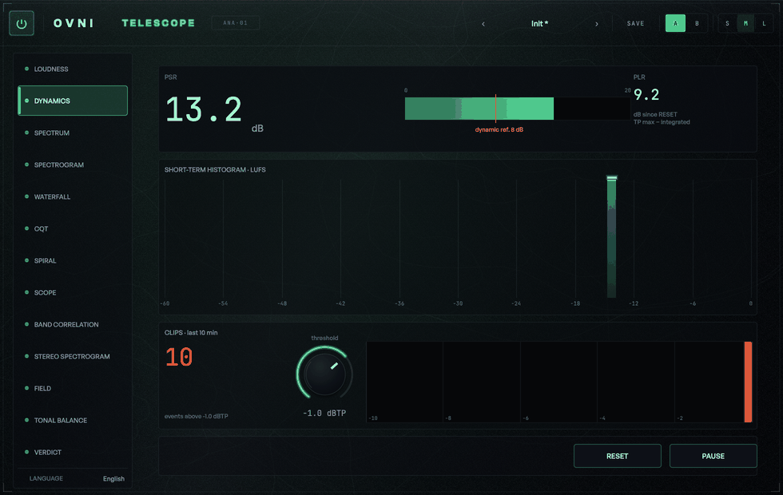

**Qué mide.** No cuán fuerte está la mezcla —eso es LOUDNESS— sino cuánto **margen** le queda.

| Lectura | Definición |
|---|---|
| **PSR** (dB) | true peak máximo de los **últimos 3 s** − short-term. La lectura en vivo. Válida sólo si ya hay short-term |
| **PLR** (dB) | true peak máximo **desde el RESET** − integrado. Es el *peak-to-loudness ratio* de AES TD1004. Válido sólo si el integrado ya pasó la compuerta |
| Histograma | short-term desde el RESET en **61 bins de 1 LU**; el bin *i* está centrado en (*i* − 60) LUFS |
| Clips | eventos por encima del umbral en dBTP (default −1.0, rango −3…0) desde el RESET |
| Línea de tiempo | 10 minutos, una marca por segundo con eventos, el ahora a la derecha |

**Cómo se lee.** Un seno estable da PSR = PLR = 0.0 dB, y ésa es la respuesta correcta, no un bug: para un
seno de 997 Hz el K-weighting aporta exactamente los +0.691 dB que la constante de BS.1770 resta, así que
LUFS = dBFS pico. Un tono estable no tiene margen de pico sobre su propio nivel.

**Un evento de clip no es una muestra sobre la raya.** Un seno de 997 Hz que se pasa durante 50 ms cruza el
umbral unas cincuenta veces —una por ciclo— para lo que cualquier oído llama *un* clip. Un evento se abre
en la primera muestra sobre el umbral y no se cierra hasta 100 ms por debajo. Medido: 10 ráfagas de 50 ms
separadas 1 s → **10 eventos**.

**Controles.** `REINICIAR` · `PAUSA` / `SEGUIR` · `umbral` (el de clip). **Cambiar el umbral reinicia el
conteo** y la línea de tiempo: un contador que mezcla eventos medidos contra dos techos distintos no
querría decir nada.

**Qué no es.** La línea de 8 dB es una *referencia*, no un veredicto. La lente la dibuja, la rotula y
muestra dónde cae tu número. No lo pinta de rojo ni escribe una conclusión. Eso es trabajo de VERDICT, con
la regla a la vista.

---

## 3 · SPECTRUM

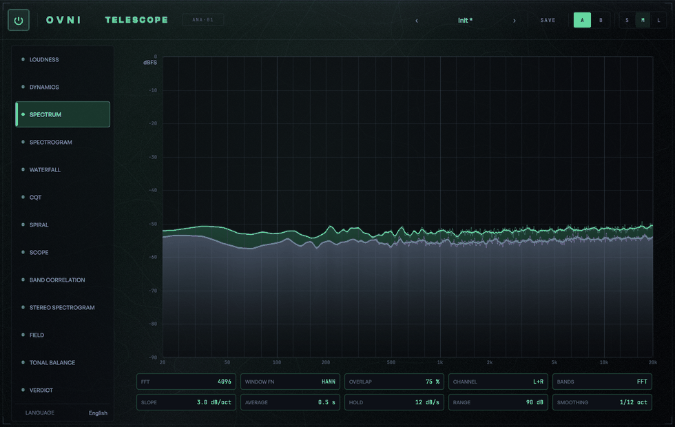

**Qué mide.** El espectro, con una referencia de dB exacta: cada bin va en **dBFS referido a un seno de
escala completa**,

> dB_k = 20 · log₁₀( 2 · |X_k| / (N · CG) )  con CG = Σw / N (la ganancia coherente de la ventana)

así que un seno de amplitud A centrado en un bin lee exactamente 20·log₁₀(A). No es una calibración a ojo:
la corrección de ganancia coherente es exacta y se verifica con las tres ventanas (−20.0000 dB con Hann,
Blackman-Harris y Kaiser).

**Cómo se lee.** Dos consecuencias de esa definición conviene saberlas antes de mirar la pantalla:

- **El ruido blanco a escala completa NO lee 0 dBFS por bin.** Su energía está repartida entre los N/2+1
  bins, así que cada bin lee mucho más abajo. Ningún analizador serio dice otra cosa; nosotros además lo
  escribimos.
- **Cambiar el tamaño de FFT mueve el piso de ruido, no el de los tonos.** Duplicar N parte cada bin en
  dos: un *tono* sigue leyendo su amplitud (toda su energía cae en un bin) pero el *ruido* baja 3 dB por
  bin. Una FFT grande "limpia" el fondo sin que nada haya cambiado en el audio.

**Controles.** `FFT` (1 024 – 32 768) · `VENTANA` (Hann 4.00 bins / −31.5 dB · Blackman-Harris 8.00 /
−92.0 · Kaiser β=9 6.06 / −66.3, los tres medidos sobre este código) · `SOLAPE` · `CANAL` (L · R · M ·
S · L+R) · `BANDAS` (libre / ⅓ de octava ISO 266, 30 bandas / Bark, 24) · `PENDIENTE` · `PROMEDIO`
(ninguno / exponencial τ 0.1–10 s / infinito) · `RETENCIÓN` (caída del peak hold, 0–60 dB/s, default 12;
medido 12.03) · `RANGO` · `SUAVIZADO` (off / 1/24 / 1/12 / 1/6 de octava, default 1/12).

**`SUAVIZADO` es un setting de PANTALLA, no de medición.** Promedia la curva que se *dibuja* sobre un ancho
fijo en octavas —la misma idea que el de SPAN— y no toca nada más: la lectura bajo el cursor, el peak hold
y todos los números que reporta esta lente siguen leyendo los bins crudos. Un analizador que suaviza el
número que reporta dejó de servir para medir. Sobre un eje logarítmico una fracción de octava es un ancho
fijo en píxeles, que es por lo que cuesta una suma corrida y nada más.

**Por qué el slope default es 3.** Un bin de FFT mide un ancho *fijo* (Δf = sr/N), mientras que la música y
el oído trabajan por octavas, cuyo ancho crece con la frecuencia. El ruido rosa —misma energía por octava,
el material neutro de referencia— cae 3 dB por octava en un espectro por bin. Con slope = 3 el rosa se ve
**plano**, que es lo que uno espera de una referencia. Medido: −0.0072 dB/oct sobre 10 s de ruido rosa
entre 100 Hz y 10 kHz.

**Qué no es.** El slope es una transformación de *display*: no toca los datos, y el número bajo el cursor
es el ya inclinado. **No** se aplica a los modos de banda — una banda de ⅓ de octava ya integra un ancho
proporcional a la frecuencia, así que aplicar los dos inclinaría el rosa 3 dB por octava hacia arriba y
dibujaría una escalera donde hay una recta.

**Una banda sin ningún bin adentro se marca distinto de una banda en cero.** Con FFT de 4 096 a 48 kHz el
bin mide 11.7 Hz y la banda de 40 Hz mide 9.3: no entra ni uno. No es "no hay energía", es *a esta
resolución esta banda no se puede medir*, y se dibuja como lo que es. Para leer graves, FFT grande.

---

## 4 · SPECTROGRAM

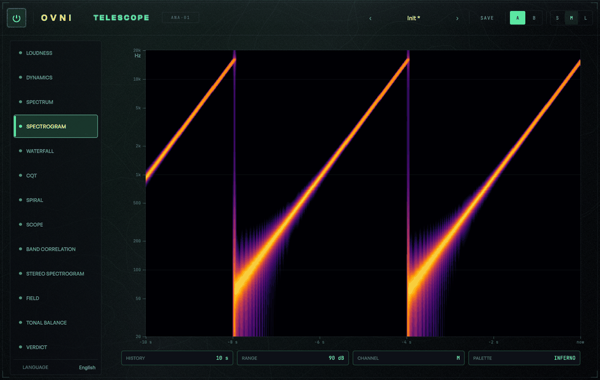

**Qué mide.** Nivel en el tiempo. Frecuencia en Y (log, 20 Hz – 20 kHz, 512 filas), tiempo en X
(10 / 30 / 60 s de historia, el ahora a la derecha) y el **nivel en el color**, mapeado sobre
`[−rango, 0]`.

**Cómo se lee.** La rampa de color es la del sello, y es **monótona en luminancia** — 0 caídas en las 256
entradas. Eso hace falta, no es decoración: acá el color *codifica* dB, así que si dos entradas se cruzaran
en brillo, dos niveles distintos se verían igual de fuertes.

**Controles.** `HISTORIA` (10 / 30 / 60 s) · `RANGO` (60 / 90 / 120 dB) · `CANAL` · `PALETA`. Los settings de FFT son
los de SPECTRUM: es la misma perilla, no una copia.

**La paleta es UN setting para cuatro lentes.** SPECTROGRAM, STEREO SPECTROGRAM (sólo su eje de nivel — la
fase sigue siendo bipolar), WATERFALL y FIELD comparten la rampa que elijas, porque es la misma decisión
mirada desde cuatro lentes. `ovni` es la rampa del sello; `inferno` y `viridis` son las tablas exactas
publicadas por Smith y van der Walt (2015, CC0, acreditadas en `NOTICE.md`); `spectrum` es la de azul →
cian → verde → amarillo → rojo → blanco. Las tres primeras son **monótonas en luminancia** —más claro es
siempre más fuerte, para cualquier par de valores— y `spectrum` a propósito no lo es: ahí lo que ordena el
nivel es el *tono*, que es una secuencia que el ojo también lee sin rótulo.

**Tres cosas que son del dato, no del dibujo.**

- Usa la potencia **instantánea**, nunca la promediada: un espectrograma *es* la evolución en el tiempo, y
  promediarlo borraría exactamente lo que muestra.
- **Cada fila toma el máximo de los bins de su celda**; sólo cuando la celda no contiene ningún bin
  (graves, donde las filas son más densas que los bins) se interpola en dB entre los vecinos. Interpolar
  siempre atenuaría los picos angostos hasta 4 dB, que es justo lo que un espectrograma existe para
  mostrar.
- **Cambiar el tamaño de FFT, el solape, el canal, el rango o la historia limpia el dibujo.** Mezclar
  columnas medidas con dos mapeos distintos sería un dibujo que miente sobre lo que ya pasó. Cambiar sólo
  la *historia* limpia el anillo pero **no** reinicia el análisis: estirar la ventana para mirar más atrás
  no puede costarte el número que estabas mirando.

**Qué no es.** La lectura al pasar el cursor se relee del anillo con la misma agrupación con la que se
pintó la columna — no se busca "el color más parecido". La paleta redondea a 8 bits y tiene diez pares de
entradas con el mismo color, así que ese método mentía un escalón (0.35 dB con rango 90) en esos niveles.
Si la columna bajo el cursor ya salió del anillo, no hay lectura.

**Con reduced-motion esta lente sigue corriendo.** Su eje X *es* el tiempo; congelarla no sería menos
movimiento, sería mostrar menos dato.

---

## 5 · WATERFALL

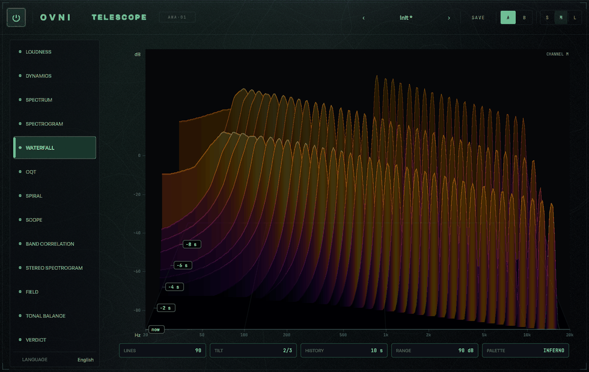

**Qué mide.** Los mismos datos del espectrograma puestos en profundidad: frecuencia en X (log,
20 Hz – 20 kHz), **nivel como altura** y tiempo en Z, con el ahora adelante y el pasado alejándose.

**Cómo se lee.** El espectrograma pone el nivel en el *color*, y el ojo compara colores mal: dos verdes
separados por 6 dB se ven casi iguales, y un pico angosto de 12 dB pasa desapercibido. Acá el nivel es
**altura**, que es la magnitud que el ojo compara mejor que ninguna otra. A cambio se pierde lo que el
espectrograma hace mejor: con 120 líneas tapándose, un evento corto puede quedar escondido detrás de uno
posterior. Son complementarias; por eso están las dos.

**Controles.** `LÍNEAS` (60 / 90 / 120) · `INCLINACIÓN` · `HISTORIA` · `RANGO`. La línea del fondo es siempre la
columna más vieja que sigue en el anillo y la de adelante la que se acaba de escribir; el reparto es
aritmética entera sobre el índice de escritura, así que el mismo anillo da siempre las mismas columnas. Si
el anillo tiene menos columnas que líneas pedidas, se dibujan las que hay: repetir una columna dibujaría un
relieve que la señal no tiene.

**Qué no es.** No hay GPU. Metal sólo existe en macOS y el contexto OpenGL de JUCE lo pelean varios hosts
con su propio dibujo; un analizador que en Windows —o en el host equivocado— muestra dos lentes menos no es
el mismo producto. La proyección es **oblicua por software**: sin división por z, tres multiplicaciones por
punto. Oblicua y no en perspectiva porque una perspectiva real divide por z, y esa división rompe dos cosas
que en un instrumento valen más que el realismo: que la misma distancia en frecuencia mida lo mismo a
cualquier profundidad, y que la proyección sea monótona.

La oclusión se dibuja del frente al fondo con un horizonte, y el resultado en pantalla es **idéntico** al
algoritmo del pintor literal — lo cual acá es demostrable, y está demostrado en `[waterfall][horizon]`,
porque la proyección es estrictamente decreciente en z. El costo con las 120 líneas está en la
[ficha técnica](../ficha.md), junto con las condiciones en que se midió — contra un presupuesto de 4 ms de
mediana y 8 de p95.

La lectura al pasar el cursor da frecuencia y dB **de la línea de adelante**, la única que se puede leer sin
ambigüedad: en profundidad una misma columna de píxel cae sobre varias líneas a la vez.

---

## 6 · CQT

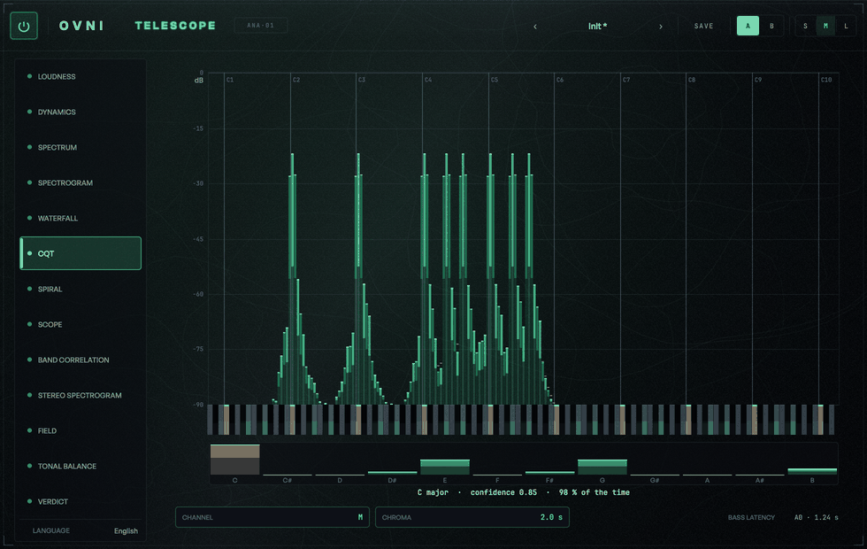

**Qué mide.** El espectro por **notas**. Un FFT reparte sus bins a distancias iguales en *hertz*; la
transformada de Q constante (Brown 1991; Brown & Puckette 1992) los reparte a distancias iguales en
*octavas* y le da a cada bin su propia ventana:

```text
B     = 24 bins por octava (dos por semitono: un cuarto de tono por bin)
f_min = 27.5 Hz  (A0, la nota más grave de un piano)
f_max = min (20 kHz, 0.45·fs)          → 229 bins a 48 kHz
Q     = 1 / (2^(1/B) − 1) = 34.127     → el mismo Q en las nueve octavas
N_k   = round (Q · fs / f_k)           una ventana de Hann por bin
```

**Cómo se lee.** Una barra por bin sobre el eje de notas —los bins *impares*, los cuartos de tono entre
notas, van más tenues— con un teclado de 114 teclas dibujado a escala debajo, para que cada barra esté
parada sobre su propia tecla. Abajo, el cromagrama en doce barras con la tónica en ámbar y la tonalidad con
sus dos números.

**Controles.** `CANAL` · `CROMA` (el suavizado del cromagrama: 0.5 / 2 / 5 s). El peak hold comparte el
decaimiento de SPECTRUM: es la misma perilla.

**El grave llega tarde por física, y la lente lo dice.** Cada bin mira `N_k` muestras hacia atrás, y eso se
divide por dos en cada octava: A0 necesita 59 567 muestras (**1.2410 s** a 48 kHz), A2 0.3103 s, A4
0.0776 s, A6 0.0194 s. No hay forma de tener resolución de un cuarto de tono en 27.5 Hz sin escuchar más de
un segundo — es física, no una decisión de implementación. TELESCOPE la **declara**, en el frame y en el
rótulo `A0 · 1.24 s` del pie de esta lente y de SPIRAL, en vez de esconderla. El soporte del kernel va
pegado al **final** del bloque, así que sólo el grave paga su ventana: centrados, hasta los bins de 20 kHz
estarían mirando 0.68 s en el pasado.

**Qué no es — la tonalidad nunca va sola.** La lente muestra siempre tres cosas juntas —`La menor ·
confianza 0.83 · 91 % del tiempo`— por dos razones medibles:

1. **La confianza tiene piso.** Es el máximo de 24 correlaciones contra los perfiles de Krumhansl &
   Kessler (1982), así que hasta un cromagrama perfectamente plano gana con alguno por azar. 6 s de ruido
   rosa dan **≈ 0.54** en la corrida de referencia; con 12 s cae a ≈ 0.38. Lo que de verdad delata al ruido es el **% del tiempo**: 37 %
   y 3 % contra el 98–100 % de una tonalidad de verdad.
2. **Hay música genuinamente ambigua.** Una tríada pelada C-E-G, todas al mismo nivel, sin bajo,
   correlaciona 0.790 con Do mayor y **0.809 con Mi menor**: gana Mi menor. No es un error — el perfil
   menor pondera su ♭6 con 3.98, y esas tres notas en un compás real podrían ser las dos cosas. Con la
   tónica doblada en el bajo —la forma normal de tocar una tríada en estado fundamental— Do mayor gana con
   **0.845** contra 0.613. Un instrumento que mostrara "Do mayor" a secas en el primer caso estaría
   eligiendo por vos.

El silencio informa **sin tonalidad** (tónica y modo en −1, confianza 0), porque "no sé" es un resultado y
"Do mayor con confianza 0" sería peor que no decir nada.

**Y el piso de faldas se publica.** Los kernels se podan en 0.0054 · max|K_k| (el umbral del paper), y eso
cobra un piso: medido sobre un A4 solo, la peor falda queda **67.5 dB por debajo** del pico. Alrededor de
una nota fuerte no hay silencio absoluto, y eso que se ve en pantalla tiene nombre y número.

---

## 7 · SPIRAL

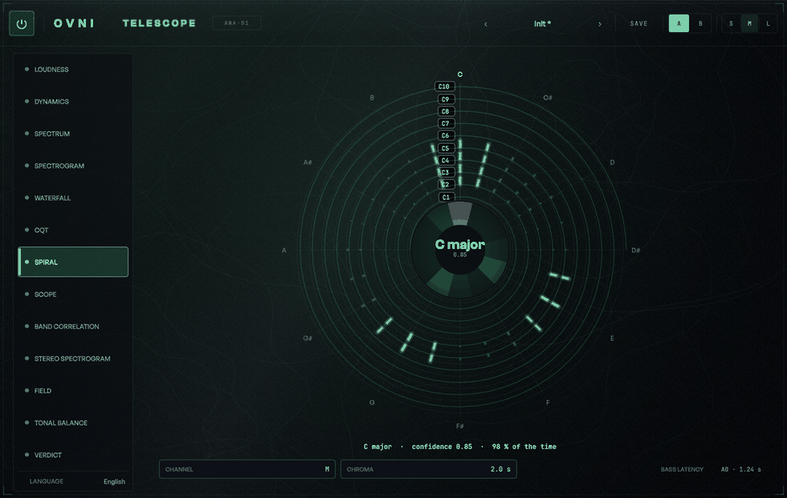

**Qué mide.** El mismo constant-Q, **enrollado**: una vuelta por octava, así las notas iguales quedan en el
mismo ángulo.

```text
ángulo = clase de nota  ·  Do arriba, sentido horario, una vuelta = una octava
radio  = octava         ·  A0 adentro, el bin más agudo afuera, lineal por octava
púa    = magnitud       ·  brillo y grosor siguen el nivel; bajo el piso del rango no se dibuja nada
```

**Cómo se lee.** Un Do en C2, otro en C4 y otro en C6 dejan de ser tres barras lejanas en un eje largo y
pasan a ser tres púas **alineadas sobre el mismo radio**. Eso es lo que CQT no puede mostrar y ésta sí: la
estructura de octavas de lo que suena, de un vistazo. En el centro, la rueda de croma: doce sectores en el
**mismo ángulo** que las púas de su clase, la tónica en ámbar y la tonalidad adentro.

**Controles.** `CANAL` · `CROMA`.

**Qué no es.** La espiral es de Arquímedes, así que una circunferencia la cruza en un solo punto: el rayo
de Do. Los círculos de guía **no** son "la octava n": son el **radio donde empieza** la octava n, y por eso
el rótulo va justo ahí. Leerlos como anillos de octava sería leer una octava de más.

---

## 8 · SCOPE

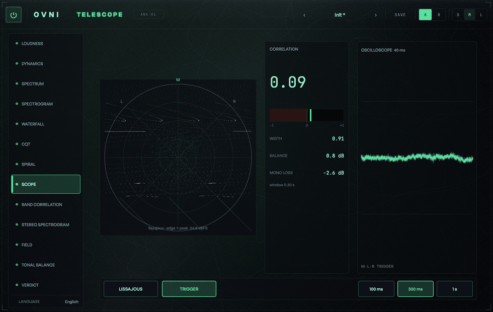

**Qué mide.** Las tres formas clásicas de *mirar* el estéreo, sobre una ventana deslizante de
**100 / 300 / 1000 ms** (default 300):

| Salida | Fórmula | Qué dice |
|---|---|---|
| **CORR** | ΣLR / √(ΣLL·ΣRR) | +1 mono · 0 decorrelacionado · −1 fuera de fase |
| **WIDTH** | √(ΣSS / ΣMM) | 0 mono · 1 dos fuentes independientes · ↑ el lado domina |
| **BALANCE** (dB) | 10·log₁₀(ΣRR / ΣLL) | + = R más fuerte, − = L más fuerte |
| **MONO LOSS** (dB) | 10·log₁₀(ΣMM) − 10·log₁₀((ΣLL+ΣRR)/2) | 0 si L=R · −3.01 si independientes · −∞ si L=−R |

con M = (L+R)/2 y S = (L−R)/2, acumuladas en `double` por hop de 100 ms. Es exactamente la matemática con
la que el sello mide ÓRBITA y PULSAR, alimentada con el mismo ruido rosa determinista, así que los números
de TELESCOPE son **directamente comparables** con los de ellos. Única diferencia declarada: acá el balance
va R sobre L; el harness de ÓRBITA imprime L sobre R — el mismo número con el signo dado vuelta.

**Cómo se lee.** `LISSAJOUS` dibuja el goniómetro, y **se auto-escala y lo dice**: el anillo exterior vale
el pico del hop (suavizado, ataque rápido y caída lenta), rotulado abajo — *"lissajous · borde = pico
−24.8 dBFS"*. Sin eso, una mezcla a −20 dBFS es un punto en el centro y el goniómetro deja de servir para
lo que sirve: leer la *forma* del estéreo, no el nivel. La amplificación topa en −40 dBFS: estirar la nube
de una señal que no está sería exactamente la clase de mentira que este plugin no hace. `POLAR` mantiene el
ángulo y hace del radio el nivel en dB, desde −60 hasta el borde.

El **osciloscopio** muestra 40 ms (1 920 muestras a 48 kHz; el buffer topa en 2 048, así que por encima de
~51.2 kHz la ventana visible se acorta). Con `TRIGGER` arranca en el primer cruce por cero ascendente de M
dentro de los primeros 20 ms; sin él, desde el arranque del hop, y se ve nadar — que es la verdad de lo que
llega. Se dibuja con envolvente min/max por columna de píxel, así que los picos no se pierden.

**Controles.** el modo (`LISSAJOUS` / `MUESTRAS POLARES` / `NIVEL POLAR`) · `TRIGGER` · `VENTANA`
(100 / 300 / 1000 ms).

**Qué no es — los casos borde, y nunca NaN ni infinito** (la UI dibuja estos números):

| Situación | Qué se publica |
|---|---|
| Sin señal (ΣLL+ΣRR ≈ 0) | todo en 0 y *"sin señal"* — que **no** es lo mismo que "mono perfecto" |
| Un canal mudo (ΣLL·ΣRR ≈ 0) | `corr = 0`: no hay correlación **definida**, no es que valga cero |
| L = −R (ΣMM ≈ 0) | `width` al tope **10** y `monoLoss` al piso **−60 dB** |
| Desbalance extremo | `balance` clampeado a **±60 dB** |

---

## 9 · SCOPE — NIVEL POLAR

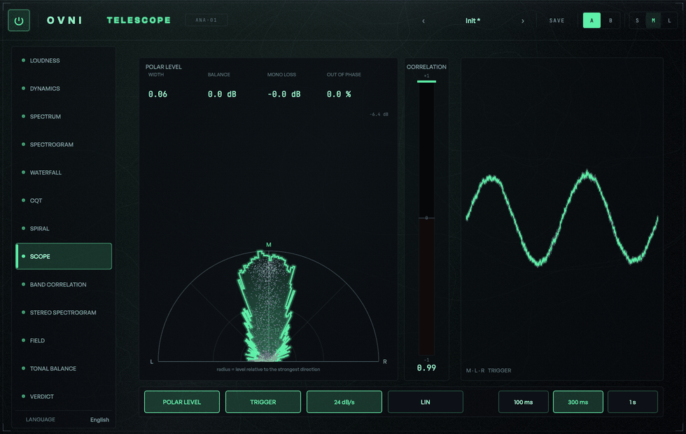

**Qué mide.** El tercer modo de SCOPE, y el pensado para mezclar: un semicírculo con **mono arriba**, **L y
R en la base**, la energía dibujada como **un rayo por grado**, la nube instantánea encima y el
correlímetro al lado. (Hasta la primera pasada visual de 0.1.0 este modo se llamaba HEMISFERIO; el nombre
*hemisferio* se sigue usando acá para el **plegado**, que es otra cosa — el modo se llama por lo que
muestra y el plegado por lo que hace.)

```text
θ = 90° + 2·atan2(R − L, R + L)     ≡     2·atan2(R, L)      (mod 360°)

sólo L → 0°   ·   mono (L = R) → 90°   ·   sólo R → 180°   ·   L = −R → 270°
```

**Un rayo por grado, en dos capas.** El motor publica 360 bins de un grado y se dibujan los 181 que van de
0° a 180°, cada uno una cuña de 1° desde el origen, recortada a [0°, 180°] para que nada cruce la base.
Encima de esos rayos van dos capas:

| Capa | Qué es |
|---|---|
| **Promedio** (rellena) | la envolvente promediada **en el tiempo**, τ = 0.3 s, en energía, bin por bin |
| **Pico** (contorno fino con glow) | la retención con decaimiento — 12 / 24 / 48 dB/s, a elección |

El promedio es **en el tiempo**, nunca **en ángulo**: promediar en ángulo es inventar una anchura que la
medición no tiene. (Hasta la primera pasada visual de 0.1.0 la envolvente pasaba por un **máximo** móvil
circular de ±2° antes de dibujarse, que convertía cada púa en una meseta plana de 5° — la escalera era del
ancho del filtro, no del dato.)

**Cómo se lee.** La nube del goniómetro dice *dónde* hay muestras; estos rayos dicen *cuánto* hay en
cada dirección, que es la pregunta de una mezcla ("¿el bajo está centrado?", "¿cuánto material tengo fuera
de fase?"). El factor **2** es lo que hace que el semicírculo de arriba cubra todo el estéreo en fase: el
cuadrante real de un vector (L, R) con las dos componentes positivas mide 90°, y acá se abre a 180°. Una
consecuencia que conviene tener: el ángulo es **lineal en el paneo**, así que las distancias en pantalla se
leen como distancias de paneo.

**Lo fuera de fase se pliega sobre la base.** La base va al **pie** del panel — el panel *es* el
semicírculo, no hay nada debajo. Lo que está fuera de fase (θ por encima de 180°) se pliega sobre la base
con θ' = 360° − θ, que manda cada dirección al lugar que le corresponde *por paneo* (θ = 190°, que es R con
la fase dada vuelta, cae en 170°, al lado de R; θ = 270°, que es L = −R, cae en 90°, al medio), y se pinta
en el color de alerta encima del lóbulo en fase. **Plegar no pierde nada**: el número se imprime al lado
—`fuera de fase N %`, medido sobre las muestras como Σ(l² + r²) de los pares con l·r < 0 sobre el total—.
El énfasis del color es proporcional a la pérdida mono medida: toda mezcla con fuentes decorrelacionadas
tiene muestras instantáneas fuera de fase —es normal— y pintarlas como una emergencia enseñaría a
desconfiar del medidor.

**El radio es nivel relativo a la dirección más fuerte** — 0 dB en el borde, −6 dB a medio radio, −12 a un
cuarto, con arcos en −6 / −12 / −18. Es lo que hace que la dirección dominante forme un **lóbulo** en vez
de un abanico. (Hasta la pasada visual de 0.1.0 el radio mapeaba −60…0 dB linealmente, y con cualquier
música real todas las direcciones caen en los 20 dB de arriba —o sea entre 0.67 y 1.0 del radio—, así que
la envolvente se pegaba al arco exterior y la lente decía "todo ancho" pasara lo que pasara.) `LIN` en el
pie cambia a una escala en dB con piso −24 para quien la prefiera leer así.

**Los cuatro números también están acá.** ANCHO, BALANCE, PÉRDIDA MONO y el porcentaje fuera de fase van
arriba del semicírculo: la columna que los lleva en Lissajous y polar la ocupa acá el correlímetro
vertical, y hasta la pasada visual de 0.1.0 en este modo simplemente no se dibujaban.

**Controles.** el selector de modo · `DECAIM. PICO` (12 / 24 / 48 dB/s; medido con 0.00 % de error) ·
`LIN` / `dB` (la escala radial). El decaimiento es la memoria de la lente, no del motor: el motor publica
la envolvente del hop sobre **todas** sus muestras, no las 2 048 decimadas que dibuja el goniómetro — una
envolvente que se saltea el transitorio miente hacia abajo justo donde interesa.

**Qué no es. No es localización.** Es dirección de paneo por energía instantánea, no de dónde viene el
sonido en una sala: no hay HRTF, ni ITD, ni nada por el estilo. La misma honestidad que el rótulo de FIELD.

**Verificado** (`[telescope][hemis]`): mono da el pico en **90°** con el resto del círculo en el piso; sólo
L / sólo R dan lóbulos limpios en **0°** / **180°**; L = −R da **270°** con el máximo del hemisferio
superior *en el piso, sin excepción*; ruido independiente da un abanico de 360° cuyos sectores 0–90 y
90–180 coinciden dentro de **0.844 dB**; un paneo de 22.5° a potencia constante cae en **45°**, que es
también lo que da el paneo por energía de FIELD vía θ = arccos(−pan); y el mono a escala completa lee
**+3.0103 dB**, porque L y R suman en cuadratura.

---

## 10 · BAND CORRELATION

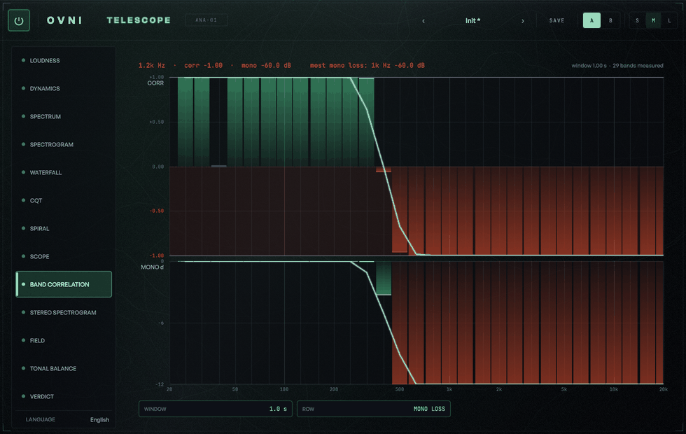

**Qué mide.** Las cinco sumas de SCOPE, **por banda de ⅓ de octava** (ISO 266, las 30 de siempre).

Por qué: un correlímetro de banda ancha, sobre una mezcla con los graves mono y los agudos abiertos, da un
número intermedio que no dice nada. Medido en la señal de prueba de la casa —seno de 80 Hz en L = R más
ruido rosa pasa-altos de 2 kHz con R = −L— la banda ancha da **corr +0.24 y mono −2.1 dB**, mientras que la
banda de 80 Hz da **+1.00** y la de 4 kHz **−1.00**. El medidor de banda ancha no está mal: hay dos cosas
distintas pasando y no puede verlas.

```text
ΣLL = Σ|L_k|²   ΣRR = Σ|R_k|²   ΣLR = Σ Re(L_k·R_k*)   ΣMM = Σ|M_k|²   ΣSS = Σ|S_k|²

corr_b     = ΣLR / √(ΣLL·ΣRR)                        width_b    = √(ΣSS / ΣMM)
balance_b  = 10·log₁₀(ΣRR / ΣLL)                     monoLoss_b = 10·log₁₀ΣMM − 10·log₁₀((ΣLL+ΣRR)/2)
```

**Y coincide con el medidor del tiempo, que es la prueba de que las dos cuentas son la misma.** La banda
ancha calculada desde los bins contra el módulo `Stereo` en el dominio del tiempo, sobre ruido rosa
independiente: `corr` difiere en **0.00076**, `width` en 0.00077, el balance en 0.0288 dB y el mono loss en
**0.0033 dB** (criterios: 0.02 y 0.1 dB). Si no coincidieran, una de las dos estaría mal.

**Controles.** `VENTANA` (0.3 / 1 / 3 s) · `FILA` (cuál de las cuatro medidas va arriba).
`K = round(segundos × frames por segundo)` frames cuyas posiciones son fijas en el stream: el determinismo
se hereda, y las 30 bandas salen **idénticas al bit** venga el audio en bloques de 1 o de 4 096. Lo que se
publica es la ventana **efectiva** (0.2987 / 1.0027 / 3.0080 s medidos), no la pedida.

**Qué no es. Una banda sin ningún bin no vale cero.** Con FFT de 4 096 a 48 kHz la banda de 40 Hz mide
9.3 Hz de ancho y el bin mide 11.7: no entra ninguno. Eso no es "correlación cero", es *a esta resolución
no se puede medir*, y la lente lo marca distinto. La lectura al pasar el cursor dice **cuántos bins**
midieron cada banda, porque en los graves pueden ser uno solo.

**Y la dispersión de los graves no es un defecto del módulo.** Un estimador de correlación sobre ruido tiene
σ ≈ 1/√(2·BW·T), y una banda de ⅓ de octava mide BW = 0.2316·fc. Con 1 s de ventana, la banda de 10 kHz
junta 2 316 grados de libertad (σ = 0.015) y la de 50 Hz junta 12 (σ = 0.21). Abajo hay menos señal por
segundo, y ningún analizador puede inventarla; lo que sí se puede es no esconderlo.

---

## 11 · STEREO SPECTROGRAM

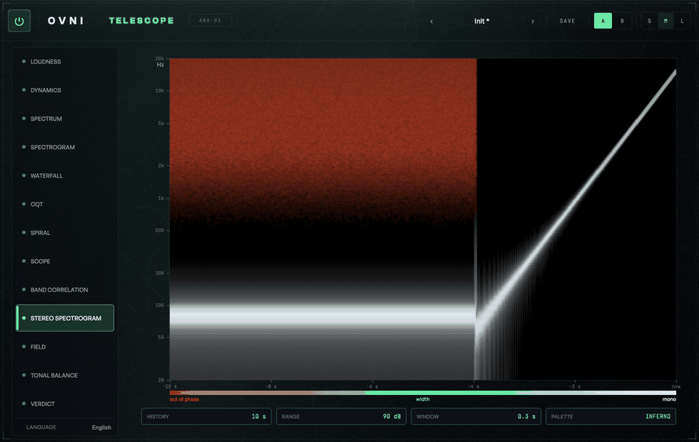

**Qué mide.** El sonograma con el color cambiado de significado: **el color es la fase** (coherencia por
bin) —rojo fuera de fase, verde ancho, blanco mono— y **el brillo es el nivel**, con el mismo mapeo de dB
sobre `[−rango, 0]`.

**Cómo se lee.** Una celda sin energía es **negra**, no "roja apagada": sin eso, el piso de ruido —donde la
fase es puro azar— pintaría la pantalla de colores que no quieren decir nada. La coherencia es
`coh_k = Σ Re(L_k·R_k*) / √(Σ|L_k|²·Σ|R_k|²)` suavizada sobre la ventana de BAND CORRELATION, y es 0 **por
definición** cuando un canal no tiene energía en ese bin: no hay dos fases que comparar. En silencio la
celda queda en el centro de la escala (128), que quiere decir *sin definir* — un 0 diría "fuera de fase",
que sobre silencio sería una alarma inventada.

**Controles.** `HISTORIA` · `RANGO` · `VENTANA`.

**Qué no es. El suavizado no es cosmético.** La coherencia de un frame solo, sobre dos fuentes
independientes, da valores repartidos por todo `[−1, +1]`: el dibujo sería confeti. Sobre la ventana se
queda alrededor de 0 **con dispersión** (medido: media 125.15 sobre 255 y desvío 16.32, o sea ≈ −0.02 ±
0.13 en coherencia), que es lo que un estimador de coherencia hace de verdad. Con L = R lee **255 en toda
celda con energía** y con L = −R lee **0**: mono perfecto es +1, no "casi".

La **energía**, en cambio, NO se suaviza: es el brillo de un espectrograma y su eje X es el tiempo. Y ojo
al compararla contra SPECTRUM: acá se suman **los dos canales** (`E_k = |L_k|² + |R_k|²`), así que una
señal mono lee 3.01 dB por encima de lo que lee el canal L solo.

---

## 12 · FIELD

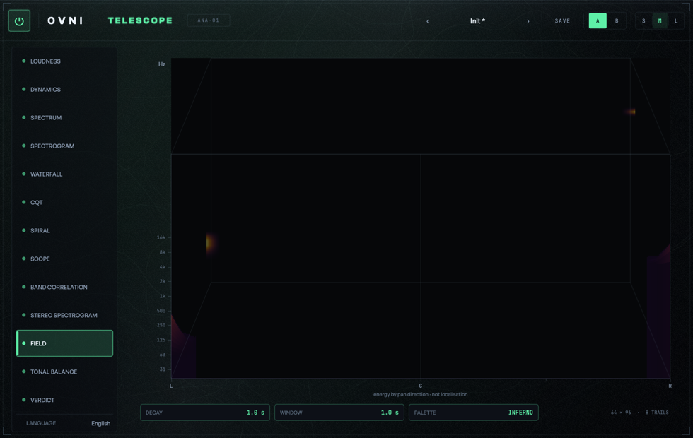

**Qué mide.** Energía por **dirección de paneo × frecuencia**, 64 columnas × 96 filas, con decaimiento y
estela temporal, en 2.5D. Por bin de la STFT:

```text
pan_k = (ΣRR_k − ΣLL_k) / (ΣRR_k + ΣLL_k) ∈ [−1, +1]
        −1 = sólo L   ·   0 = centro (o sin energía)   ·   +1 = sólo R
```

Con la ley de potencia constante (L = cos θ·x, R = sin θ·x) el número es exacto y redondo: `pan = −cos 2θ`.
Verificado bin a bin con un error peor de **4.9·10⁻⁸**: 0° → −1.000 · 22.5° → −0.707 · 45° → 0.000 ·
67.5° → +0.707 · 90° → +1.000.

**Cómo se lee — lo que muestra y ninguna otra puede.** Los cuatro números de banda ancha de una mezcla con
dos fuentes duras en canales opuestos son casi idénticos a los del ruido decorrelacionado (`corr ≈ 0`,
`width ≈ 1`): para un correlímetro las dos "suenan igual de anchas". En FIELD una es dos manchas en
esquinas opuestas y la otra una nube pareja de lado a lado. Esa diferencia es todo el punto de la lente.

**Controles.** `DECAIMIENTO` (0.5 / **1** / 2 s; medido 0.512 / 1.003 / 2.005) · `VENTANA` (0.3 / 1 / 3 s,
la misma de las lentes 10 y 11). Por frame, `grid *= exp(−dt/τ)` y después cada bin suma su energía — un
promediado exponencial, así que sin señal nueva la grilla cae a 1/e en exactamente τ. No es decoración: a
21 ms por frame, sin él la lente sería confeti.

**Qué NO es — y esto no se puede apagar.**

**No mide la posición de las fuentes.** De una mezcla estéreo terminada ese problema no tiene solución
única, y es exactamente la trampa en la que cayó ÓRBITA: el retardo interaural implementado valía el 8 %
del físico y con el signo invertido, y el plugin lo llamaba "posición" (auditoría del 2026-09-03). Un
analizador del mismo sello no puede repetir ese error en la lente que más invita a cometerlo. Por eso, y
sin poder apagarse:

- el eje se rotula **L … C … R**, nunca `−90° … +90°` como si fuera azimut binaural;
- debajo del eje va, fijo: **"energía por dirección de paneo · no es localización"**;
- la lectura da el paneo en **porcentaje**, no en grados.

**Tampoco distingue mono de fuera de fase.** L = R y L = −R tienen la misma energía en los dos canales, así
que las dos dan `pan = 0` y las dos se dibujan en el centro. Es correcto —FIELD mide balance de nivel, no
fase— y es justo lo que las lentes 10 y 11 sí muestran. Las tres se leen juntas.

**Dos límites honestos de la resolución.** Por debajo de ~1.5 kHz una fila de la grilla es *más angosta que
un bin* de la STFT (a 100 Hz la fila mide ~7.5 Hz y el bin de una FFT de 4 096 a 48 kHz mide 11.72 Hz), así
que un tono grave cae entre dos bins que van a filas distintas y su energía queda repartida: lee más bajo
que un tono agudo de la misma amplitud. Medido con dos tonos idénticos: el de 5 kHz lee 0.0 dB rel y el de
100 Hz, −2.9. Y el ancho de la nube depende de la ventana: con material decorrelacionado el paneo por bin
se reparte alrededor de 0 con la dispersión del *estimador* (0.137 medido con 1 s). `VENTANA` cambia cuánto
se abre la nube. Lo que **no** es, es una medida de ancho estéreo en grados.

**El dB de la lectura es RELATIVO** al máximo de la grilla, y está rotulado `dB rel`. La celda acumula
energía por un promedio exponencial, así que su valor absoluto depende de τ y de la tasa de frames;
convertirlo a dBFS pediría una división válida sólo en régimen. Un número absoluto aproximado en un medidor
es peor que uno relativo exacto — y el nivel absoluto ya lo dan SPECTRUM y SPECTROGRAM, que lo miden sin
aproximar.

---

## 13 · TONAL BALANCE

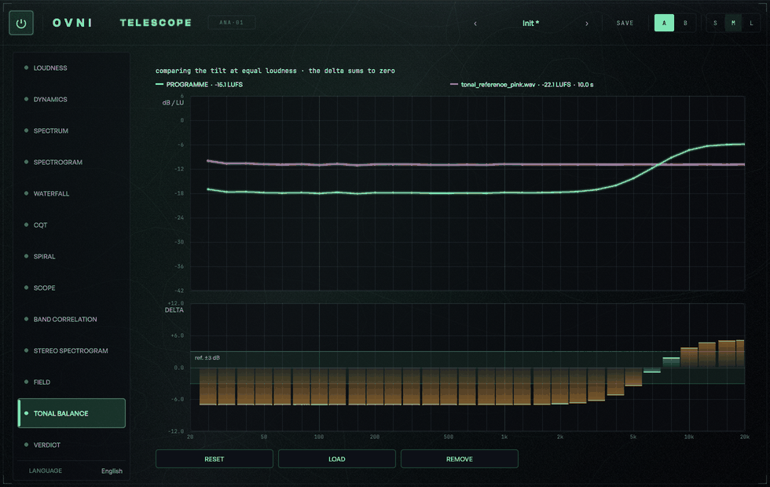

**Qué mide.** No "¿cuánto suena?" sino **"¿de qué color suena, comparado con esto otro?"**. Cargás un track
de referencia —el tuyo, o uno comercial—, TELESCOPE lo analiza **entero, offline**, y la lente compara tu
programa en vivo contra él.

**Compara el tilt, no el nivel.** Las dos curvas de ⅓ de octava se normalizan restándoles **su propio LUFS
integrado**:

```text
norm[b]  = curva[b] − LUFS integrado          (cada lado con el suyo)
delta[b] = live_norm[b] − ref_norm[b]
```

El mismo ruido rosa a −14 y a −20 LUFS da **delta 0 en todas las bandas** (verificado: el peor caso sobre
24 bandas entre 50 Hz y 10 kHz es 0.66 dB, y ese resto es la varianza del propio ruido con 10 s). Si no se
normalizara, el gráfico contestaría "cuál está más fuerte", que ya lo dice el medidor de loudness.

**Y la consecuencia, dicha en voz alta: el delta suma cero.** Si le subís 6 dB a todo lo que está arriba de
2 kHz, **la loudness sube con eso**, y el delta no muestra "+6 arriba y 0 abajo". Muestra esto (medido, no
estimado):

| | delta |
|---|---|
| el shelf aplicado | +6.00 dB arriba de 2 kHz |
| lo que subió la loudness integrada | +4.30 dB |
| delta que dibuja la lente ≥ 8 kHz | **+1.70 dB** |
| delta que dibuja la lente ≤ 500 Hz | **−4.30 dB** |

Los dos números son la **misma verdad**: la diferencia entre las dos regiones sigue siendo exactamente
6 dB. Lo que cambia es que está contada **a igual volumen**, que es como se compara una mezcla contra una
referencia. La identidad se verifica banda por banda con un error máximo de **0.006 dB** sobre 21 bandas.

**Cómo se lee.** Arriba, las dos curvas normalizadas sobre la rejilla logarítmica de SPECTRUM, cada una
rotulada con su nombre y su integrado, en escala **fija** de +6 a −42 dB — una escala que se auto-ajusta
hace que dos capturas de la misma mezcla no se puedan comparar, que es justo para lo que la lente existe.
Abajo, el delta como barras de ±12 dB con una banda de referencia de **±3 dB rotulada**. Esa banda es una
*referencia, no un veredicto*: no dice "está mal", dice cuánto y dónde. Un vértice **por banda** (30), no
por píxel: ponerle más sería inventar resolución que el dato no tiene. Una banda que sólo mide uno de los
dos lados **no** se dibuja en delta 0 —eso sería decir "coincide perfecto"— sino que corta la curva y marca
su barra en gris.

**Qué se puede dibujar, y las dos formas en que se cortaba la línea.** Una banda se dibuja cuando su valor
crudo está **en −90 dBFS o por encima** *y* su normalizada **entra en el plot** (por encima de −42 LU). Es
comparable cuando los dos lados se pueden dibujar. Donde la referencia no tiene nada que decir la lectura
dice `sin referencia en esta banda`; donde sí tiene algo que decir pero el número se cae por abajo del
plot, dice `referencia por debajo del rango (−42 LU) en esta banda` — que es otro hecho y merece otra
frase.

Eran dos defectos distintos los que cortaban la línea, y ninguno era la música:

- **el piso de −200 dB.** Hasta la pasada visual de 0.1.0 el umbral era el valor de guarda del análisis, no
  un nivel: una banda que medía −123 dBFS —el redondeo del propio análisis— contaba como medición, así que
  la curva la dibujaba cien decibeles por debajo del plot (una raya vertical hasta el borde) y el delta
  contra ella daba +106 dB, un número que no puede existir entre dos programas.
- **la rejilla de la FFT.** La potencia de banda tomaba **bins enteros**: de `ceil(lo/binHz)` a
  `ceil(hi/binHz)`, y cuando los dos redondeaban al mismo entero la banda quedaba **vacía** teniendo
  energía de sobra. Con FFT de 4 096 a 48 kHz el bin mide 11.719 Hz y la banda de 40 Hz mide 9.26 —0.79 de
  un bin— así que 30–50 Hz mostraba un hueco en **las dos** curvas. A 44.1 kHz el hueco se mudaba a 25 Hz.
  Ahora cada bin aporta **en proporción a lo que se solapa con la banda**, así que ninguna banda por debajo
  de Nyquist queda vacía:

  ```text
  overlap_k = max(0, min(hi, (k+½)·binHz) − max(lo, (k−½)·binHz))
  P_banda   = ( Σ_k P_k · overlap_k / binHz ) · (hi − lo) / Σ_k overlap_k
  ```

  La lectura se hace cargo de la consecuencia: la cuenta de bins es **fraccionaria**, y una banda más
  angosta que un bin (`0.8 bins a esta FFT`) es la densidad de ese bin, no una medición independiente.

**Controles.** `REINICIAR` (reinicia el promedio del programa y **no** descarga la referencia: se tira lo
medido, no lo que configuraste) · `CARGAR` (o arrastrá un archivo sobre la lente) · `QUITAR`.

**Qué no es.** El estado guarda la **ruta**, no los números. Al abrir una sesión guardada, si el archivo
sigue estando se **vuelve a analizar**; si no está, la lente dice `referencia no encontrada: <nombre>` y no
dibuja ninguna curva. Guardar 30 números en el preset y dibujarlos como si fueran el archivo sería mostrar
una referencia que ya no existe, sin que nadie pudiera notarlo.

SPECTRUM **no** hace la corrección de ancho cubierto de esta lente: sus barras de ⅓ de octava son la suma
cruda, que es la convención de un RTA. En las bandas graves las dos lecturas difieren, y es a propósito: la
de acá es la que se puede comparar entre sample rates.

---

## 14 · VERDICT

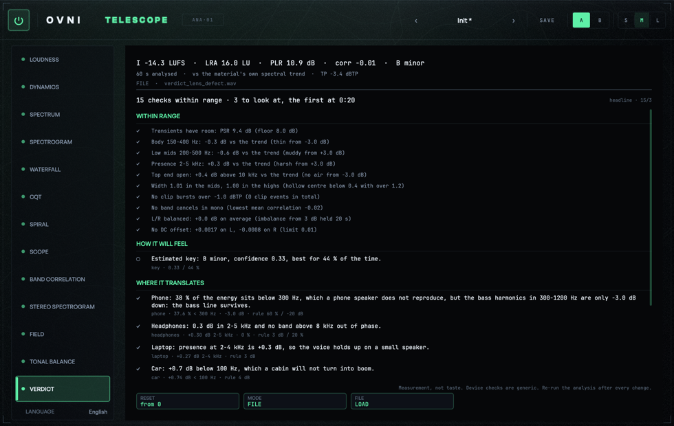

Doce lentes muestran. Ésta **dice**. Y la regla de hierro es que **cada frase lleva el número que la
sostiene y el id de la regla que la produjo**, los dos visibles al mismo tiempo.

**Qué es.** Un motor de reglas determinista: sin IA, sin red, sin modelo — una tabla de umbrales
(`source/data/Rules.h`) y las condiciones que los leen. La misma señal da el mismo informe, palabra por
palabra, hoy y dentro de un año. Corre en tu máquina y no manda nada a ningún lado. El gemelo legible de la
tabla —cada umbral con su porqué— está en [`../telescope-diccionario.md`](../telescope-diccionario.md).

**Cómo se lee.** Primero un **titular**, fijo bajo la cabecera: la cuenta de lo medido, sin adjetivos —
*"15 chequeos dentro de rango · 3 para revisar, el primero en 0:20"*. Después, cuatro secciones: **dentro de
rango** · **cómo se va a sentir** · **dónde traduce** · **qué revisar y dónde**. Un **hallazgo** es ⚠ o ●.
Las líneas ○ —la tonalidad, una caja que sale ✓, la distancia a la plataforma— son informativas, no son
defectos y no cuentan como "para revisar".

**Dentro de rango va primero.** Cada regla que se evaluó y **no** se disparó tiene una fila corta con el
número que midió y el límite de la regla: *"Los transitorios tienen aire: PSR 9.4 dB (piso 8.0 dB)"*,
*"Medios graves 200-500 Hz: -0.6 dB contra la tendencia (turbio desde +3.0 dB)"*. Una regla que no pudo
evaluarse no dice nada: "dentro de rango" es una medición, no un valor por defecto. Cuando la lente no tiene
alto para la lista entera, la sección se colapsa a una sola fila que nombra cada regla (los zooms S / M / L
del editor escalan el lienzo entero, así que ahí la lente mide lo mismo en los tres y la sección va
desplegada).

**Cómo se lee un hallazgo.** El número primero, el término de mezcla entre paréntesis y, al final, dónde
mirar — nunca qué hacer: *"630 Hz cae 26.0 dB bajo su propia media (la banda mas honda de un tramo de
400-1000 Hz que cae entre 0:20 y 0:35). Revisa que suena en ese rango ahi."* Un pozo que atraviesa varias
bandas contiguas al mismo tiempo es **un** hallazgo, no uno por banda: el número es el de la banda más honda y
la ventana de tiempo es la del tramo entero (desde la primera banda que cae hasta la última que vuelve). Un
pozo medido es ⚠: el ● queda para lo objetivamente roto (ráfagas de clips, continua, bandas que se cancelan en
mono). La línea gris de evidencia
suma los umbrales de la regla al número medido: `hole · -25.96 dB / 15 s · rule 6 dB / 10 s`.

(Las frases de VERDICT se escriben sin tildes en las seis tablas, igual que desde el prompt 55: es la
convención de `Rules.h`, y el pie que no se toca también la usa.)

**Contra qué compara.** Las reglas de la sección 1 preguntan si una región sobra o falta. Sobra *respecto
de qué*, y la frase dice siempre cuál usó:

| Situación | Contra qué | Qué significa |
|---|---|---|
| **con referencia cargada** | la referencia, comparadas por su **forma** (cada curva menos su propio nivel de banda ancha) | "esta región no se parece a la mezcla que elegiste como objetivo" |
| **sin referencia** | la **tendencia del propio material**: recta de mínimos cuadrados sobre la forma del programa en log de frecuencia, entre 50 Hz y 16 kHz | "esta región no se parece al resto de tu propia mezcla" |

La segunda es deliberada. La alternativa habitual —tener escondida en el código una "curva de una buena
mezcla" y medir contra ella— es opinar disfrazado de medir. Contra la propia tendencia no hay nada que
opinar. **A cambio es un instrumento grueso**: una mezcla con una intención espectral fuerte puede disparar
una regla sin que haya nada que arreglar. **Cargar una referencia es estrictamente mejor.**

**Controles.** `RESET` · `MODO` (vivo / ARCHIVO) · `ARCHIVO` → `CARGAR` (o soltá un archivo) · `IDIOMA` (en
la tira de lentes: el idioma es del plugin, no de esta lente).

**Qué no es.**

- **No opina.** Está prohibido que diga "suena profesional", "emociona" o "está listo". Si alguna vez lo
  dice, es un bug — y `VERDICT[tono]` barre las seis tablas de frases, palabra por palabra, buscando
  justamente esa clase de palabras.
- **Los chequeos por dispositivo son genéricos, y lo dice.** Las seis cajas (celular, auriculares, laptop,
  auto, club con sub mono, hi-fi) **no** son mediciones de ningún parlante real, ni simulaciones, y **no
  hay ninguna curva de respuesta adentro del plugin**: cada caja es una definición de qué clase de sistema
  es —dónde empieza a responder, dónde se cae, qué le pasa al estéreo— y su chequeo mira el material contra
  esa definición. Sirven para decir "esta mezcla apoya casi todo donde un teléfono no llega". Eso es un
  pronóstico, y sale rotulado como pronóstico.
- **El pie no se puede sacar:** *"Medición, no gusto. Chequeos por dispositivo genéricos. Rehacé el
  análisis tras cada cambio."*

### "Sin hallazgos" no es "está terminado"

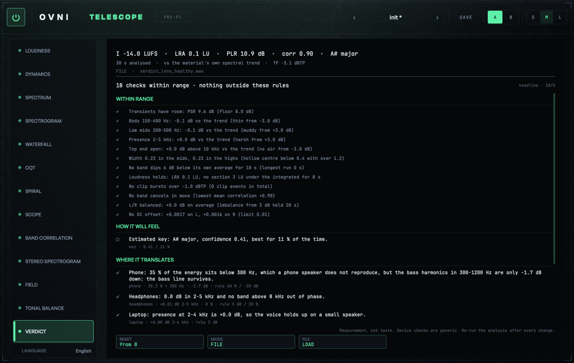

Cuando no encuentra nada, lo que dice es: *"Nada fuera de rango en estas reglas. Miden; lo que no escuchan
es tuyo."* No dice "listo". La diferencia es todo el producto: las reglas cubren lo que cubren, y lo que no
está en la tabla no se mide.

### De dónde sale el "dónde"

`analysis/SecondHistory.h` guarda 10 minutos a 1 Hz desde el último RESET: por segundo, las 30 bandas de ⅓
de octava con su nivel, su correlación y su pérdida al monoficar, el short-term mínimo y máximo, el pico
real, los clips, el estéreo de banda ancha, la continua y la tonalidad. **Las filas del análisis de archivo
son las del análisis en vivo, iguales al bit** (`HISTORY[identidad]`, 60 de 60 filas sobre un tema de un
minuto). Por eso "hay un hueco entre 0:20 y 0:35" quiere decir lo mismo mirando el archivo que
escuchándolo.

**La parte espectral de la fila se paga sólo con la lente abierta.** Con VERDICT y TONAL BALANCE cerradas,
las filas siguen guardando loudness y continua —que son baratos— y **declaran que no tienen espectro**, en
vez de publicar treinta ceros que parecerían una medición. En la práctica: si abrís VERDICT a mitad de un
tema, el informe empieza ahí. Para tiempos exactos de un tema entero, el modo **ARCHIVO**.

---

# Lo demás

## Cargar una referencia, y analizar un archivo

Arrastrá un archivo de audio sobre TONAL BALANCE, o sobre VERDICT en modo ARCHIVO.

**El análisis offline es idéntico al vivo — no "parecido": idéntico al bit.** El motor decide las
posiciones de hop y de frame contando muestras desde el reset, no según el tamaño de bloque del host, y el
camino offline usa las *mismas clases*, no una segunda implementación. Verificado por el camino completo
contra el mismo WAV leído por `FileAnalyzer`: integrado, LRA, true peak y los máximos M/S iguales al bit;
las 30 bandas de ⅓ de octava con medición, iguales al bit; bloques de 4 096 vs 512 vs 64 vs 7 vs 1, iguales
al bit.

**Formatos:** WAV, AIFF, FLAC y Ogg siempre; en macOS además todo lo que lea CoreAudio (MP3, AAC, ALAC), y
en Windows WMA y MP3. Es lo que da JUCE de fábrica: no hay un decoder propio, y por lo tanto tampoco un
formato que "casi" se lee. Se acepta **cualquier** archivo arrastrado, no sólo las extensiones conocidas:
si no se puede leer, el mensaje lo dice. Rechazar en silencio un AIFF llamado `.dat` es peor que intentarlo.

**El sample rate es el del archivo.** No se remuestrea: el motor se prepara a la SR del archivo y lo mide
tal cual está. Ni los ⅓ de octava ni el LUFS dependen de la SR, así que una referencia a 44.1 k es
directamente comparable contra un programa a 48 k. Remuestrear sólo agregaría un filtro más entre el
archivo y su propia medición.

**Velocidad:** 60 s de audio en un cuarto de segundo en un M4 (243 ms con la máquina quieta, 633 ms con carga; el test exige menos de 6 s), con progreso y cancelación.

## Reduced motion

TELESCOPE respeta el ajuste de movimiento reducido del sistema, por lente y con honestidad:

- **SCOPE**: el goniómetro no deja estela — sólo el hop actual, un cuadro estático coherente. NIVEL POLAR no
  tiene memoria: las dos capas —promedio y pico— son el hop.
- **SPECTRUM**: no hay suavizado entre frames; se dibuja el frame tal cual llega.
- **FIELD**: no se dibuja la estela (queda sólo la grilla actual) y el suavizado de la normalización se
  apaga.
- **SPECTROGRAM, STEREO SPECTROGRAM y WATERFALL siguen corriendo.** Su eje de tiempo *es* el dato;
  congelarlas no sería menos movimiento, sería menos información. Y no hay nada suavizado que apagar: cada
  columna es una columna del anillo tal cual se escribió.

## Idioma

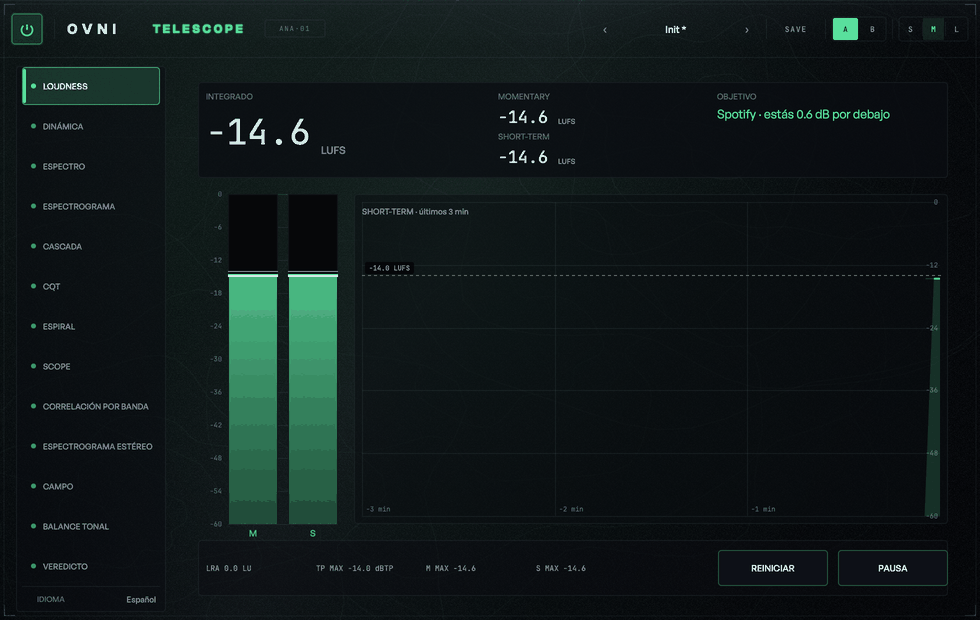

`IDIOMA` (`LANGUAGE` en inglés), al pie de la tira, cambia **todo** el plugin — las trece lentes, no tres. Muestra el endónimo
("Español", "Deutsch") y no el código: quien no lee inglés tampoco sabe que su idioma se llama `de`.

Hoy hay seis: **`en` y `es` revisados**; **`pt`, `fr`, `de` e `it` traducidos con los términos de la
industria y pendientes de revisión de un hablante nativo.** El default es inglés. El fallback es **por
clave**: si a un idioma le falta una frase, esa frase sale en inglés y el resto del idioma queda intacto —
nunca vacía, porque una etiqueta en blanco en un medidor es peor que una en el idioma equivocado: no se
sabe si es un bug o un valor que no existe. La matriz completa clave × idioma está en
[`../strings-matrix.md`](../strings-matrix.md).

**Los nombres de nota siguen la convención de cada idioma**, que no es una traducción sino **tres** sistemas
distintos y vivos: letras (C D E) en el mundo anglosajón, solfeo (Do Re Mi) en el románico, y el germánico
—letras salvo en dos posiciones, donde B es **Si♭** y la nota de arriba se llama **H**—. Mostrarle "B" a un
lector alemán donde suena un Si le nombra otra nota, un semitono más arriba.

El nombre **con octava** (`A4`, `C#3`) se queda en anglosajón a propósito y no es una inconsistencia: ahí se
rotula un *eje*, y los ejes de los analizadores del mundo dicen C1, no Do1.

## De dónde salen los números

Cada número de este manual lo produce un test contra una señal sintética, en el repositorio, ejecutable:

```bash
cmake --preset dev
ninja -C build telescope_VST3 telescope_AU telescope_Standalone OvniTelescopeTests
ctest --test-dir build -R telescope --output-on-failure
```

La tabla tag por tag está en el [`README.md`](../../README.md) del plugin (sección "Verificación"), y ahí
mismo está el desarrollo técnico completo de cada decisión. El presupuesto de pintado de cada lente —4 ms
de mediana y 8 de p95 en tamaño L— lo mide `[budget]` y se publica junto con el factor de carga `k` de la
máquina que lo midió, así el número nunca viaja sin la condición en la que se tomó.

---

## Licencia

**AGPLv3**, como todo el catálogo OVNI. Fuente: <https://github.com/ovniaudio/ovni>.
Avisos de terceros: [`NOTICE.md`](../../../../NOTICE.md).
Consultas: <hello@ovniaudio.com> · <https://ovniaudio.com>
